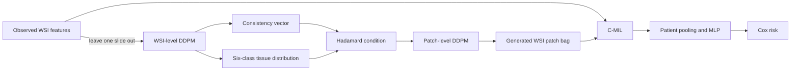

# WSI-Diffusion

Official PyTorch implementation of **“From Representation Space to Prognostic Insights: Whole Slide Image Generation with Hierarchical Diffusion Model for Survival Prediction”**, AAAI 2025.

[Paper](https://doi.org/10.1609/aaai.v39i7.32788) · [AAAI page](https://ojs.aaai.org/index.php/AAAI/article/view/32788) · [中文说明](#中文说明)

WSI-Diffusion generates missing whole-slide-image representations in two stages. A WSI-level conditional diffusion model first generates a global consistency vector and a six-class tissue distribution. A patch-level conditional diffusion model then generates a patch bag under the joint WSI/tissue condition. Real and generated slide bags are aggregated by C-MIL and optimized with a Cox survival objective.



## What is included

- Otsu tissue masking and non-overlapping WSI patch extraction.
- TorchScript adapters for HIPT-style patch and WSI encoders.
- HoVer-Net/PanNuke nucleus import and six-class patch majority voting.
- Patient-disjoint five-fold splitting with a 10% training-fold validation set.
- Leave-one-slide-out WSI diffusion for consistency and tissue-distribution generation.
- Tissue-aware patch diffusion with deterministic largest-remainder class allocation.
- Hierarchical C-MIL, patient pooling, Cox partial-likelihood training, EMA and early stopping.
- C-index, STAGE-5, bootstrap intervals, slide-count bias groups, ablations, sensitivity sweeps and case-study visualization.
- Restartable, stage-wise experiment orchestration through one command-line program.

The repository deliberately keeps the implementation in a small number of substantial files. This makes the complete mathematical path easy to trace without hiding logic behind a large framework hierarchy.

```text
configs/
  default.yaml              official training configuration
  paper_experiments.yaml    cohorts, ablations and sensitivity matrices
examples/                   manifest and HoVer-Net schemas
src/wsi_diffusion/
  config.py                 strict configuration and overrides
  data.py                   records, feature store, splits and preprocessing
  models.py                 both DDPMs, hierarchical generator and C-MIL/Cox
  engine.py                 training, evaluation, checkpoint and metrics
  cli.py                    all commands and experiment orchestration
tests/                      focused data, model and pipeline tests
```

## Installation

Python 3.8+ and PyTorch 1.9.1+ are supported. OpenSlide is needed only for raw WSI preprocessing.

```bash
git clone https://github.com/t-zhihao/WSI-Diffusion.git
cd WSI-Diffusion
conda env create -f environment.yml
conda activate wsi-diffusion
```

Alternatively:

```bash
python -m pip install -e ".[all]"
```

The paper experiments used four NVIDIA V100 GPUs. The released command line also supports CPU and a single CUDA device; select one with `--set experiment.device=cuda:0`. Batch sizes in `configs/default.yaml` are global values for the current process.

## Data contract

WSIs, clinical tables, HIPT weights and HoVer-Net weights are not redistributed. Build one CSV manifest per cohort:

```csv
dataset,patient_id,slide_id,wsi_path,feature_path,time,event
TCGA-LUAD,TCGA-XX-0001,TCGA-XX-0001-01A,/secure/a.svs,data/features/a.pt,721,1
TCGA-LUAD,TCGA-XX-0001,TCGA-XX-0001-02A,/secure/b.svs,data/features/b.pt,721,1
```

Required semantics:

- `patient_id` groups all WSIs belonging to one patient.
- `slide_id` is unique within the manifest.
- `time` is a finite positive survival/follow-up duration, in days by default.
- `event=1` means an observed event and `event=0` means censored. If a source table stores a censor flag, set `data.event_column_semantics=censored`; ingestion converts it once.
- `feature_path` points to a trusted `.pt` or `.npz` bundle. Do not load untrusted pickle-backed PyTorch files.
- Paths may be absolute or relative to the repository root.

Each feature bundle contains:

```text
wsi_feature:    float tensor [C_wsi]
patch_features: float tensor [number_of_patches, C_patch]
tissue_labels:  integer tensor [number_of_patches], values 0..5
metadata:       optional mapping
```

The canonical tissue order is:

```text
0 neoplastic
1 dead
2 inflammatory
3 non_neoplastic_epithelial
4 connective
5 no_label
```

Use [examples/manifest.example.csv](examples/manifest.example.csv) and [examples/hovernet.example.json](examples/hovernet.example.json) as schemas. Keep protected data under `data/`; the directory and model artifacts are excluded from version control.

## Preprocessing

Patch extraction uses an Otsu-derived tissue mask, a non-overlapping sliding window and a configurable tissue-fraction threshold. The preprocessing command accepts TorchScript encoders so the feature contract stays independent of a particular HIPT checkout.

```bash
wsi-diffusion preprocess \
  --config configs/default.yaml \
  --patch-model /path/to/patch_encoder.ts \
  --wsi-model /path/to/wsi_encoder.ts
```

For each slide, place HoVer-Net output at `data/hovernet/<slide_id>.json`. PanNuke nucleus types are mapped to the six tissue classes from the default configuration. Empty patches receive `no_label`.

## Quick start

Point the default configuration to a cohort manifest and output location. Dotted overrides are strict: a misspelled key fails immediately.

```bash
wsi-diffusion validate --config configs/default.yaml
wsi-diffusion split --config configs/default.yaml
wsi-diffusion run --config configs/default.yaml --folds 0 1 2 3 4
```

The end-to-end `run` command executes, per fold:

1. fit normalization on training patients only;
2. train the WSI-level diffuser;
3. train the patch-level diffuser;
4. generate fold-local synthetic slide bags;
5. train the C-MIL/Cox model;
6. evaluate the held-out fold;
7. aggregate the selected folds.

Completed stages receive a small completion marker and can be resumed. Use a new `experiment.output_dir`, or remove the relevant output stage, when changing data or scientific settings.

Individual stages are also exposed:

```bash
wsi-diffusion train-wsi      --config configs/default.yaml --fold 0
wsi-diffusion train-patch    --config configs/default.yaml --fold 0
wsi-diffusion generate       --config configs/default.yaml --fold 0
wsi-diffusion train-survival --config configs/default.yaml --fold 0
wsi-diffusion evaluate       --config configs/default.yaml --fold 0
```

Common options:

```text
--set key=value       repeatable strict configuration override
--verbose             console debug logging
--fold N              one outer fold
--folds N [N ...]     selected outer folds; omitted means all configured folds
```

## Paper experiments

The cohort paths and paper experiment definitions live in a single file, [configs/paper_experiments.yaml](configs/paper_experiments.yaml). This includes Table 4 ablations, Table 5 patch-level timestep sensitivity, Table 6 generation strategies and the Figure 4 generation grid.

```bash
wsi-diffusion matrix \
  --config configs/default.yaml \
  --experiments configs/paper_experiments.yaml \
  --name table4_ablation

wsi-diffusion matrix \
  --config configs/default.yaml \
  --experiments configs/paper_experiments.yaml \
  --name table5_patch_timesteps
```

For a direct sweep on the currently selected cohort:

```bash
wsi-diffusion sweep --config configs/default.yaml --kind timesteps
wsi-diffusion sweep --config configs/default.yaml --kind generation-grid
wsi-diffusion sweep --config configs/default.yaml --kind strategies
```

Table 5 varies only the patch-level diffusion steps; WSI-level steps remain 30. `unequally` sets every patient's final original-plus-generated slide count to the cohort maximum. The complete release default generates three slides with 1,000 patches per generated slide.

## Evaluation and outputs

Each fold is isolated under `experiment.output_dir/fold_<n>/`:

```text
resolved_config.yaml
normalizer.pt
checkpoints/{wsi_diffuser,patch_diffuser,survival}/
generated/{train,validation,test}/
predictions/{train,validation,test}.csv
history_*.json
metrics.json
stages/*.complete.json
```

The primary metric is Harrell's C-index. The release also reports a five-bin fixed-year stage accuracy using 1/2/3/4-year boundaries; ambiguous censored examples are excluded. Each metrics file records the definition, evaluated count, comparable-pair count and bootstrap success count. Low, medium and high slide-count groups are `<3`, `=3` and `>3` original WSIs.

Generate a joint real/generated t-SNE case study with:

```bash
wsi-diffusion case-study \
  --config configs/default.yaml \
  --fold 0 \
  --patient-id TCGA-XX-0001 \
  --output outputs/case_study.csv \
  --figure outputs/case_study.png
```

## Implementation notes

- WSI diffusion is trained by selecting one target slide and averaging the remaining patient slides as the condition.
- The WSI target is the concatenation of a global consistency vector and tissue proportions. The two epsilon losses have separate equal-weight controls.
- Tissue proportions are projected onto the probability simplex before patch allocation.
- Patch conditions are the elementwise product of the generated WSI condition embedding and a learned tissue-class embedding.
- Integer tissue counts use largest-remainder allocation and always sum to the configured patch budget.
- C-MIL maps every slide bag to 64 channels, averages slide vectors into a patient vector and predicts one log-risk value.
- Cox optimization uses the conventional `event=1` indicator and supports Breslow or Efron ties.
- Real WSI patch subsampling is disabled by default. Set `data.max_patches_per_real_slide` only when a memory cap is required.

## Dataset sizes reported in the paper

| Cohort | Patients | WSI counts reported |
|---|---:|---:|
| NLST | 449 | 1,224 |
| TCGA-LUSC | 504 | 1,100 + 512 |
| TCGA-LUAD | 514 | 1,067 + 541 |
| TCGA-BRCA | 1,098 | 1,133 + 1,978 |
| TCGA-BLCA | 412 | 457 + 469 |

Use a frozen manifest when comparing against these results because upstream archives can change over time.

## Third-party assets

This repository contains adapters, not third-party code or weights. Obtain HIPT and HoVer-Net assets from their official projects and follow their licenses. PanNuke-derived HoVer-Net weights are intended for non-commercial research under their published terms. Do not commit protected WSIs, clinical data or pretrained weights.

## Testing

The compact test suite covers data contracts, patient leakage checks, DDPM equations and shapes, tissue allocation, Cox/C-index behavior, C-MIL bags and stage orchestration.

```bash
python -m pytest
python -m compileall -q src tests
```

## Citation

```bibtex
@inproceedings{tang2025representation,
  title     = {From Representation Space to Prognostic Insights: Whole Slide Image Generation with Hierarchical Diffusion Model for Survival Prediction},
  author    = {Tang, Zhihao and Zhang, Xi and Li, Chaozhuo},
  booktitle = {Proceedings of the AAAI Conference on Artificial Intelligence},
  volume    = {39},
  number    = {7},
  pages     = {7329--7337},
  year      = {2025},
  doi       = {10.1609/aaai.v39i7.32788}
}
```

## 中文说明

这是论文的官方 PyTorch 实现。仓库保留了完整的 WSI 预处理、两级条件扩散、组织类别控制、C-MIL/Cox 生存预测、五折交叉验证、消融实验和敏感性分析，但将实现合并为少量核心文件，便于阅读、修改和直接发布。

最短运行流程为：

```bash
conda env create -f environment.yml
conda activate wsi-diffusion
wsi-diffusion validate --config configs/default.yaml
wsi-diffusion split --config configs/default.yaml
wsi-diffusion run --config configs/default.yaml
```

请先把 `configs/default.yaml` 中的 manifest 路径改成自己的数据。临床标签在代码中统一采用 `event=1` 表示事件发生、`event=0` 表示删失；如果原表保存的是删失标记，把 `data.event_column_semantics` 改为 `censored`。原始 WSI、临床数据、HIPT 权重和 HoVer-Net 权重均不应上传到公开仓库。

## License

Code in this repository is released under the [MIT License](LICENSE).
